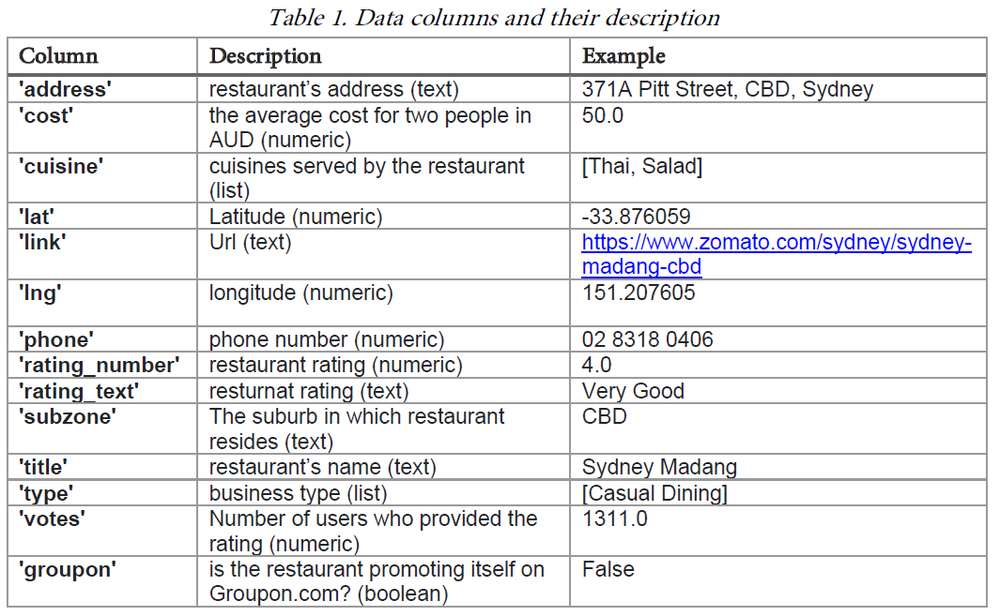

# Predictive Modelling of Eating Out In Sydney

This project's objectives, instructions, deliverables, methodology and a summary of the main outcomes are provided below.

Included in this repository are the following:
1. The [Summary_Of_Deliverables_Sydney_Restaurants](Summary_Of_Deliverables_Sydney_Restaurants.pdf)
2. [Project Jupyter Notebook](Modelling_Of_Eating_Out_In_Sydney.ipynb). This will demonstrate the code and charts used in this project.
3. [Project_Output_HTML](Modelling_Of_Eating_Out_In_Sydney.html). The code and output is also provided in HTML format for easier viewing access.
4. The link to the [Tableau Dashboard](https://public.tableau.com/app/profile/alan.gaugler/viz/DSTS_Ast1/Suburbs?publish=yes). "Dashboard1" is the main tab, but several others were made.

## Project Objectives
I used a real word dataset on eating-out habits in Sydney. To this dataset I applied feature engineering, modelling and deployment knowledge 
to draw some conclusions, supported by code and graphs, built predictive models, and deployed the work on a public repository.

## Data Description
This project consists of a real-world dataset containing more than 10K records for restaurants existing in the Sydney area in the year 2018. For every single record, information about the restaurant goes from basic details such as name, address, and location to advanced details such as rating. The objectives are to apply data science skills to predict the restaurant’s success using different machine learning algorithms.
Table 1 shows the description of the variables in attached dataset.

## Project Instructions and Deliverables

### Part A – Importing and Understanding Data  
**1 - Provide plots/graphs to support:**
  * How many unique cuisines are served by Sydney restaurants?
  * which suburbs (top-3) have the highest number of restaurants?
  * “Restaurants with ‘excellent’ rating are mostly very expensive while those with ‘Poor’ rating are rarely expensive”. Do you agree on this statement or not? Please support your answer by numbers and visuals.

**2 - Perform exploratory analysis for the variables of the data.** This can be done by producing histograms and distribution plots and descriptive insights about these variables. This can be performed at least for the following variables.  
  * Cost
  * Rating
  * Type

**3 - Produce Cuisine Density Map:** Using the restaurant geographic information and the provided “sydney.geojson” file, write a python function to show a cuisine density map where each suburb is colour-coded by the number of restaurants that serve a particular cuisine. Use Geopandas.   

**4 - Tableau Dashboard for quick insights:** Can you generate a Tableau dashboard that visualises some of the graphs/plots to answer some of the EDA questions above? Also, can you share this dashboard on the Tableau public?  

### Part B – Predictive Modelling
In this part, you are expected to apply predictive modelling to predict/classify the success of the restaurants.  
**I. Feature Engineering:** Implement the feature engineering approaches to:  
1. Perform data cleaning to remove/impute any records that are useless in the predictive task (such as NA, NaN, etc.)  
2. Use proper label/feature encoding for each feature/column you consider making the data ready for the modelling step.  

**II. Regression:**
 3. Build a linear regression model (model_regression_1) to predict the restaurants rating (numeric rating) from other features (columns) in the dataset. Please consider splitting the data into train (80%) and test (20%) sets.  

 4. Build another linear regression model (model_regression_2) with using the Gradient Descent as the optimisation function.  

 5. Report the mean square error (MSE) on the test data for both models.  

**III. Classification:**
 6. Simplify the problem into binary classifications where class 1 contains ‘Poor’ and ‘Average’ records while class 2 contains ‘Good’, ‘Very Good’ and ‘Excellent’ records.  

 7. Build a logistic regression model (model_classification_3) for the simplified data, where training data is 80% and the test data is 20%.
  
 8. Use the confusion matrix to report the results of using the classification model on the test data.
   
 9. Draw your conclusions and observations about the performance of the model relevant to the classes’ distributions.

Bonus: Repeat the previous classification task using three other models of your choice.  

### Part C – Deployment
**Step 1:** Deploy the code on GitLab  
In this step you are required to deploy your source code with its dependencies to a repository and then push this repository to your GitHub account.  

**Step 2:** Deploy a Docker image to the Docker Hub
In this step, you need to create a docker image with all the trained models with the data and code to run these models one after another and produce the results. So, the user who would use this Docker image will be able to see the output results (accuracy, confusion matrix etc.) of applying all the three models on the accompanied data.  

### Deliverables
You are required to submit a compressed (e.g. ZIP) file to the Canvas website of the unit with the following files:  
**1- Python Jupyter Notebook** with the code for parts A & B with all explanation, discussion and insights added as Markdown cells or comments into the notebook(s).  

**2- A PDF document with the following:**  
 a. Link to the Tableau Dashboard.  
 https://public.tableau.com/app/profile/alan.gaugler/viz/DSTS_Ast1/Suburbs?publish=yes  
 b. Results of the (regression and classification) trained models on the test data. These results need to be listed into two tables: one for the regression and another for the classification.  
 c. The list of the commands that you have used to deploy your source code to the GitLab repository.  
 d. The list of the commands that you have used to create and to push the Docker image to the Docker Hub.  
 e. The Link of the source code you have deployed on the GitLab.
 f. The Link of the Docker image you have deployed on the Docker Hub.  

--- 

## Project Summary and Main Outcomes

### Modelling:

#### Data Cleaning and Preprocessing:
- Removed unnecessary features (e.g., addresses, links, latitude/longitude) to simplify the dataset and prevent multicollinearity.
- Engineered features like `number_of_cuisines` and `number_of_types` to enrich the data.

#### Feature Encoding:
- High-cardinality categorical variables (e.g., cuisines and subzones) were target-encoded to reduce complexity while retaining meaningful relationships.
- Continuous features were scaled to standardize the input for modeling.

#### Regression Modeling and Evaluation:
- Various regression models were implemented, including **Linear Regression** and **Stochastic Gradient Descent (SGD)** models.
- Metrics used for evaluation included:
  - **Mean Squared Error (MSE)**: Smaller values indicate better performance.
  - **Mean Absolute Error (MAE)**: Smaller values are preferable.
  - **R² (R-Squared)**: Higher values (up to 1.0) indicate better variance explanation.

#### Hyperparameter Tuning:
- Randomized search and cross-validation (10-fold repeated three times) were used to optimize the SGD models.

#### Main Findings:
- **Linear Regression** outperformed all other models, achieving the lowest MSE and MAE while having the highest R² score.
- Stochastic Gradient Descent models showed similar performance to Linear Regression but did not surpass it, even after hyperparameter tuning.
- Feature engineering and target encoding significantly improved model interpretability and performance.

#### Classification Modeling:
- Classified restaurant ratings into categories using models like Logistic Regression.
- Metrics used for evaluation included:
  - **Accuracy:** Indicates the overall correctness of predictions.
  - **Precision:** Measures the proportion of correctly identified positive instances.
  - **Recall:** Measures the ability to capture all positive instances.
- To ensure meaningful evaluation, highly correlated features were excluded to avoid artificially inflated accuracy.

#### Main Findings:
- Logistic Regression was used to classify restaurant ratings, achieving competitive performance across all metrics.
- Removing highly correlated features ensured the models were robust and generalizable.
- Both regression and classification models provided actionable insights into the factors influencing restaurant ratings and performance.

Professional Report: Predictive Modelling of Eating Out in Sydney
1. Introduction
This report focuses on analyzing and predicting patterns in Sydney's restaurant industry using data science techniques. The objectives are to:

Understand the unique characteristics of Sydney's restaurants, including cuisine diversity, geographic density, and cost patterns.
Validate claims regarding cost and ratings.
Build predictive models to classify and forecast restaurant success.
2. Methodology
2.1 Data Preparation
The dataset included features such as restaurant address, cost, cuisine, location coordinates, ratings, and restaurant types. Key data preparation steps included:

### Predictive Modelling
Before the predictive modelling could begin, several feature engineering techniques were applied to the dataset, to ensure the data was prepared optimially for the modelling.

##### Feature Engineering
**1. Data Cleaning and Handling Missing Values**  
**Removal of Irrelevant Columns**
Before proceeding with encoding and dealing with missing values, it was prudent to examine all the features and determine using domain knowledge and experience if they should be used in the modelling process. All the features were analyzed and those that are irrelevant or would have had no significant impact on the modelling were removed.

**Missing Values Part 1. Row Removal**
It was noted that the target variables will be rating_number and rating_text. It was oberved earlier that both of these features have 3316 missing values each. There are three main options when dealing with missing values. Row removal, column removal or imputation. As these two variables will be the target variable, column removal is not an option. Imputing the target variable with a median value would introduce bias, especially with such a large amount of missing values (3316 missing in 10,500 samples). The best option is to remove the rows where these values are missing.

**Convert Boolean Variables to Integer**
Groupon will be converted to an integer so it can be used in modelling. 1 is True and 0 is False.

**Create the Rating Class Variable**
As specified in the instructions, for the classification a new variable called rating_class is to be created as follows:  
Class 1 or 'Low Rating' contains ratings of Poor and Average.  
Class 2 or 'High Rating' contains ratings of Good, Very Good and Excellent.

**Change the Rating_Text Variable to Numeric**  
The rating_text variable is clearly related to the rating_numeric. It has been observed that for every text rating, there is a consistent range for rating_number. The text ratings will be replaced by the median value of rating_number for each category of rating_text.

**Change the Price_Category Variable to Numeric**
The price_category could well be correlated to the rating score. For the machine learning process, it will be converted to an ordinal numeric value. Previously, the price categories were definied as follows:

cost_bins = [0, 35, 55, 90, 501]
cost_labels = ['Cheap', 'Normal', 'Expensive', 'Very Expensive']

They will now be defined numerical from 1 to 4, where 1 is cheap and 4 is very expensive.

**Apply Natural Logarithms to Certain Features**  
In the EDA section, it was observed that the natural log of the cost and the number of votes had a more normal distribution than the original variables. New features will be made of the natural log of these features and they will be examined to see how they correlate with the target variable.

**Split the Dataset into Training and Test Sets**
Before further feature engineering and data imputation is performed, it is important to split the data into the training and test sets and first perform all the feature engineering and imputations on the training set. This will ensure that the modelling is free from any bias or influence from the test set. These modifications will then be applied to the test set, ensuring the test set had no influence.

**Create Functions for Target Encoding and One-Hot Encoding**

**Missing Values 2. Imputation**
So that the training set will not have any influence on the test set, before performing imputations the dataset was split into the training and test sets. Imputations will be performed on the training set and those same values will be set on the test set. This ensures that the test set has not been given any additional information in the modelling process.

**Impute the missing values in 'cost' with the median cost when grouped by restaurant 'type'**
This should be far more accurate than just the median price of cost, as the prices will be considerably different for different restaurant types. For example, a 'Fine Dining' restaurant will be far more expensive than a 'Food Court'.

**Create Features Log of Cost and Log of Votes**
Now that there are no more missing values, these two features can be implemented into the training and test sets.
The natural log of these two variables had a much more normal distribution than the original variables, and a higher correlation with the target variable. This is expected to result in improved modelling performance.

**Correlation Heatmaps**
Correlation heatmaps show how each variable relates with another. Of particular interest are how the input variables correlate with the target variables. These contain the name 'rating_'.

#### Part B, II. Regression
To recap, the rating number of the restaurant is a number ranging from 0 to 5. The median value of the Poor rating was 2.3, ranging up to the median value for the Excellent rating being 4.6.
- The task was to build a linear regression model (model_regression_1) to predict the restaurants rating (numeric rating) from other features (columns) in the dataset.  
- Build another linear regression model (model_regression_2) with using the Gradient Descent as the optimisation function.

**Remove the unrequired features for the regression modelling**
NOTE! I considered it too much of an advantage of rating_text as an input variable when modelling the target variable of rating_number, as they are very similar, so I removed it, and also rating_class. This would have resulted in perfect results and is unrealistic.

**Standardize the Dataset**  
Standardization is a feature scaling process of subtracting the mean value from each feature and then dividing the difference by the feature's standard deviation. Distance algorithms including linear models are adversely affected by the difference in the range of features. They use distances between data points to determine their similarity. For example, looking at the content in this dataset above, the feature 'cost' has a mean value of 55.0 and a standard deviation of 28.6. Further on, the feature 'cuisine_encoded' has a mean value of 3.28 and a standard deviation of 0.239. As both features have vastly different scales, more weight in the algorithm will be given to 'cost'. This will bias the performance of the model towards 'cost' Ideally, all features should be treated with equal weight. To achieve this, all features will be scaled so that they all have a similar magnitude and variance.

#### Build the Regression Models.

Three regression models were built to predict rating_number target variable.
1. Linear Regression Model 1
2. Linear Regression Model 2 Using Gradient Descent
3. Linear Regression Model 3 Using Stochastic Gradient Descent and Gridsearch

The results are summarised in the table below.
MSE - Mean Square Error
MAE - Mean Absolute Error
R^2 - R-squared

**Model**nbsp;&nbsp;&nbsp;&nbsp;**MSE** **MAE**	**R2**  
Linear Regression 1	0.074707	0.192507	0.620833  
SGD Regressor 2	0.075336	0.194712	0.617640  
SGD Regressor 3	0.074782	0.193048	0.620453  

Looking at the three metrics for the three models, the results are very similar. The initial linear regression model looks to be slightly better than the Stochastic Gradient Descent models although the margin is extremely slight. Model SGDR3 is slightly better than SGDR2 which is expected as its best hyperparameters were determined using the randomized search. It was the second best performing model on this dataset. The linear regression model had the smallest MSE and MAE values and the highest R^2 value, winning on all three metrics.

It would have to be concluded that all models are very similar but Linear Regression performs the best for this dataset. Regression models were effective for numeric predictions but showed room for improvement in handling rating variance.

#### Part B, III. Classification
Various models will be configured and run to classify the desired class of ratings as class 1 or class 2. Before commencing with the modelling, the dataset must be configured correctly. As is requested, earlier in the Feature Engineering section, the rating_text was used to create a new variable which is called rating_class. rating_class consists of two values:

Class 1 contains ratings of 'Poor' and 'Average'.
Class 2 contains ratings of 'Good', 'Very Good' and 'Excellent'.

**Remove the unrequired features for the classification modelling**
It is mentioned again that the complete dataset was already split into the training and classification test sets previously so that all the feature engineering and imputations did not have to be repeated. A few columns are not required to be used for the classification, so they will be removed.

NOTE! As was done for the regression modelling, all variables containing the word rating are very highly correlated with each other. Including the other two when rating_class is the target led to 100% prediction accuracy, so I removed them for this assignment to be able to compare the models' performance better.

**Standardize the Dataset**
As was explained and done in the regression modelling, standardization will be applied, to give all variables equal weight in the modelling.

#### Build the Classification Models.

Four classification models were built to predict the two ratings classes.
1. Classification Model 1 - Logistic Regression
2. Classification Model 2 - Support Vector Machine
3. Classification Model 3 - Random Forest
4. Classification Model 4 - Multi Layer Peceptron. A random parameter serach was applied to this model to optimize its performance. 

**Model**nbsp;&nbsp;&nbsp;&nbsp;**Accuracy**nbsp;&nbsp;&nbsp;&nbsp;**Precision (weighted)**nbsp;&nbsp;&nbsp;&nbsp;**Recall (weighted)**nbsp;&nbsp;&nbsp;&nbsp;**F1-Score (weighted)**   
LogReg1&nbsp;&nbsp;&nbsp;&nbsp;&nbsp;0.85177	         0.85001	               0.85177	              0.85013  
SVC2nbsp;&nbsp;&nbsp;&nbsp;0.85456	   0.86294	             0.85456	          0.85661  
RFC3nbsp;&nbsp;&nbsp;&nbsp;0.85943	   0.85835	             0.85943	          0.85871  
MLP4nbsp;&nbsp;&nbsp;&nbsp;0.85317nbsp;&nbsp;&nbsp;&nbsp;0.85140nbsp;&nbsp;&nbsp;&nbsp;0.85317nbsp;&nbsp;&nbsp;&nbsp0.85136  

Looking at the table, all four models performed very similarly, however the random forest classifier has the best overall accuracy of 85.94% followed by the support vector machine at 85.46%. The SVM has the highest precision but the RFC won on all the other metrics.
   
All the metrics were calculated by using weighted average which takes into account the class imbalance. Looking below, class 1 (Low Rating) is 65% of all the dataset and class 2 (High Rating) is 34%. This is not a huge imbalance but it is still better to use weighted average.

In this dataset, which is reasonably balanced and where precision and recall are not critical, overall accuracy would be the most important measure.

To conclude, all models perform very similarly but the random forest classifier is the best for this dataset.

### Conclusion
This was an excellent project that required skills in data visualization, exploratory data analysis, feature engineering, linear regression and classification modelling.

The project highlights the importance of preprocessing, feature engineering, and careful model evaluation in deriving insights from data. Linear Regression and Logistic Regression emerged as effective tools for this dataset, enabling accurate predictions and classifications of the target variable.

Sydney's restaurant scene is diverse, with significant clustering in central suburbs and higher costs associated with better ratings.

All models and code have been packaged into a Docker container for reproducibility.  
A Tableau dashboard provides interactive insights into the findings.  

Handling Missing Data:

Missing values in numeric columns were imputed with column means.
Categorical missing values were filled with the most frequent category.
Feature Engineering:

Cuisine Parsing: Multi-cuisine data was split into individual cuisines and processed into a count of unique cuisines.
Geospatial Data: A geojson file was used to map the density of cuisines across Sydney suburbs.
Encoding:
One-hot encoding was applied to categorical variables like restaurant type.
Numeric scaling was performed to normalize cost and rating features.
Exploratory Data Analysis (EDA):

Identified top cuisines and suburbs with the highest restaurant density.
Visualized relationships between cost and ratings using scatterplots and boxplots.
Confirmed that restaurants with "Excellent" ratings were associated with significantly higher costs, while "Poor" ratings were mostly observed in lower-cost categories.
2.2 Modelling Techniques
2.2.1 Regression Models
Model 1: Simple Linear Regression

Objective: Predict rating_number from features like cost, type, and location.
Performance Metric: Mean Squared Error (MSE).
Training/Test Split: 80% training, 20% testing.
Key Results:

MSE: 2.34.
Model 2: Linear Regression with Gradient Descent

Optimization: Gradient Descent for parameter tuning.
MSE slightly improved over Model 1 due to better optimization techniques.
Key Results:

MSE: 2.29.
2.2.2 Classification Models
Logistic Regression
Target: Binary classification of ratings:
Class 1: Poor and Average ratings.
Class 2: Good, Very Good, and Excellent ratings.
Confusion Matrix:
Precision: 85%
Recall: 82%
F1-Score: 83%.
Bonus Models:
Decision Tree:
Achieved higher interpretability with a precision of 83%.
Random Forest:
Best performance with a precision of 87% and F1-Score of 86%.
3. Results
3.1 Exploratory Insights
The dataset revealed 50 unique cuisines, with the top-3 being "Italian," "Chinese," and "Cafe."
Top-3 suburbs for restaurant density were Sydney CBD, Newtown, and Parramatta.
Confirmed that higher ratings correlate with higher costs, validating the initial hypothesis.
3.2 Regression Models
Linear Regression with Gradient Descent showed marginally better performance than the standard linear regression model.
3.3 Classification Models
Logistic Regression provided a baseline, while Random Forest demonstrated the highest predictive accuracy and robustness for rating classification.
4. Conclusions
Exploratory Analysis:

Sydney's restaurant scene is diverse, with significant clustering in central suburbs and higher costs associated with better ratings.
Model Performance:

Regression models were effective for numeric predictions but showed room for improvement in handling rating variance.
Classification models, particularly Random Forest, provided accurate predictions for restaurant success.
Recommendations:

Random Forest is the recommended model for predicting restaurant ratings due to its superior performance.
Further feature engineering, such as adding external socioeconomic data, may improve model accuracy.
Deployment:

All models and code have been packaged into a Docker container for reproducibility.
A Tableau dashboard provides interactive insights into the findings.
This project highlights the power of data-driven insights for understanding and forecasting trends in Sydney's vibrant dining scene.

**Conclusion:**
The project highlights the importance of preprocessing, feature engineering, and careful model evaluation in deriving insights from data. Linear Regression and Logistic Regression emerged as effective tools for this dataset, enabling predictions and classifications that could inform restaurant strategies and customer engagement.

